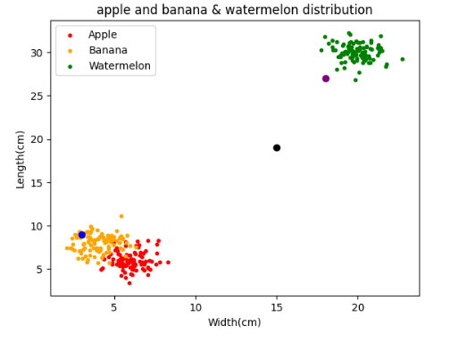

# k-Nearest Neighbors (kNN) algorithm for 3 classes
simple project using KNN algorithm with Python
## Library used:
- [matplotlib]()
- [Numpy]()

 Implement the KNN algorithm for 3 classes,Apple,Banana and watermelon

 
