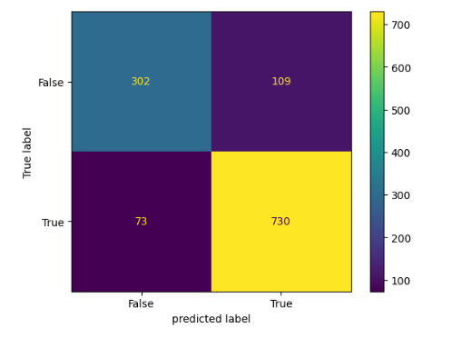

## KNN using ANSUR II dataset
## preprocessing:
- convert weight to kg
- convert height to cm
- convert Gender column(str) to number: female= 0 & male =1

## Split dataset to Train(80%) and Test(20%) datasets
## Fit object oriented KNN algorithm on the train 
|  | k=3 | k=5|k=7|
|----------|----------|----------|------------|
|  2 Features ("stature" , "weightkg")  |  0.83  | 0.84  |  0.84    |
|  3 Features ("stature" , "weightkg" , "biacromialbreadth") | 0.91  |  0.917 |  0.916    |
| 4 Features (stature" , "weightkg" , "biacromialbreadth" , "shouldercircumference")  |  0.950 |  0.953 |  0.953  |

## Calculate confusion matrix using scikit-learn
