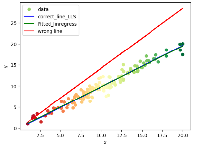
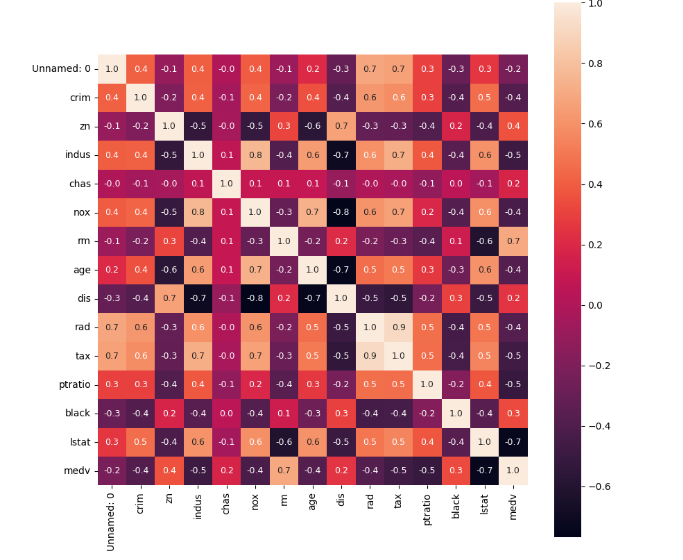
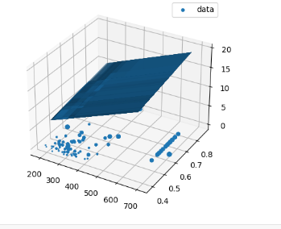

## Linear Least Squares(LLS)
### 1- student performance(Regression)
Generating continuous random dataset for the problem of X = study hours and Y = grade of students, then Splitting dataset to train and test with train_test_split function.
Drawing some wrong red lines with a random slope.
Drawing the correct blue line using Object Oriented Linear Least Squares (LLS) method.finding a relation between study hours and grade of students with LLS algorithm.

### 2- Boston House Price(Regression)
Loading Boston dataset from the scikit-learn library. This dataset has 13 features for each house. According to data correlation and its analysis, choosing features for X, for example: X = area and age and choose 1 target for Y: Y = price Split the dataset to train and test with train_test_split function. Solving the regression problem on 2 dimensions (2 features) using Object Oriented LLS. Showing results on a 3D plot and draw the y_pred as a plane on it

